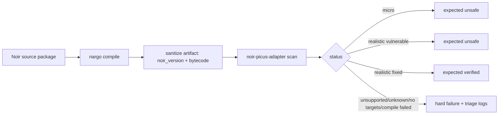
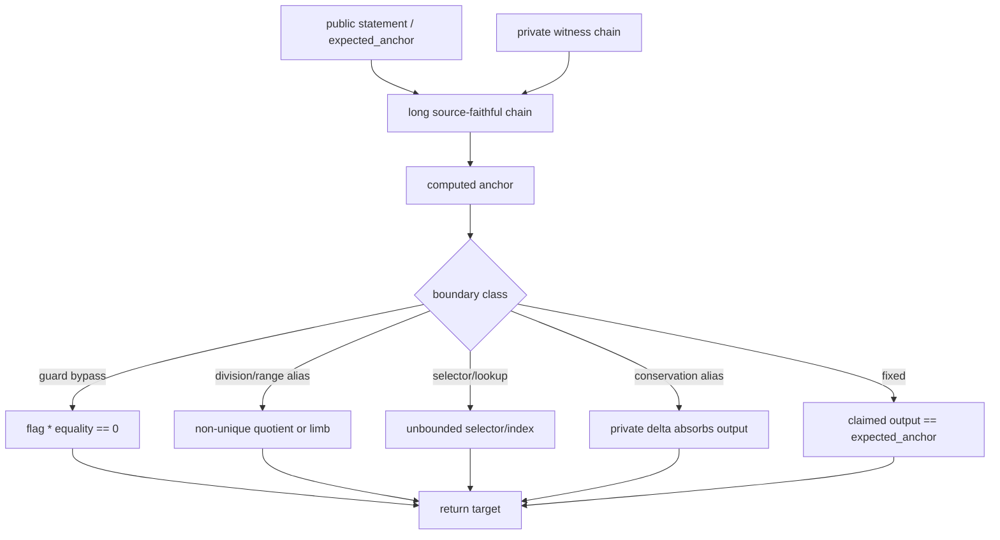

# Corpus Comparative Analysis

Цель корпуса теперь разделена на две разные проверки:

| Tier | Rows | Назначение | Expected |
| --- | ---: | --- | --- |
| Micro | 40 | Быстрая регрессия конкретных bug-boundary паттернов из реальных audit/disclosure | `40 unsafe` |
| Realistic | 40 | Medium/large/stress схемы для эффективности, runtime и false-positive проверки | `20 unsafe`, `20 verified` |

Micro tier отвечает на вопрос: "видим ли мы известный класс уязвимой цепи?".
Realistic tier отвечает на другой вопрос: "как инструмент ведет себя, когда
та же уязвимая граница находится внутри более длинной схемы?".

## Gate Flow



Каждый gate пишет диагностику в `/tmp`:

| Gate | Summary | Logs |
| --- | --- | --- |
| Micro | `/tmp/noir-picus-corpus/summary.tsv` | compile, scan JSON, verbose scan, SMT dump |
| Realistic | `/tmp/noir-picus-realistic-corpus/summary.tsv` | compile, scan JSON, verbose scan, SMT dump |

## Realistic Results

Последний прогон:

| Group | Count | Avg constraints | Avg scan time | Max scan time |
| --- | ---: | ---: | ---: | ---: |
| medium vulnerable | 12 | 187 | 0.10s | 0.14s |
| medium fixed | 12 | 188 | 0.08s | 0.19s |
| large vulnerable | 6 | 387 | 0.18s | 0.22s |
| large fixed | 6 | 388 | 0.15s | 0.19s |
| stress vulnerable | 2 | 2051 | 0.64s | 0.67s |
| stress fixed | 2 | 2052 | 0.48s | 0.48s |

Slowest vulnerable checks:

| Case | Constraints | Time |
| --- | ---: | ---: |
| `stress_rollup_mega_batch/vulnerable` | 2051 | 0.67s |
| `stress_vm_mega_trace/vulnerable` | 2051 | 0.62s |
| `stress_rollup_mega_batch/fixed` | 2052 | 0.48s |
| `stress_vm_mega_trace/fixed` | 2052 | 0.48s |
| `large_private_rollup_batch/vulnerable` | 387 | 0.22s |
| `large_zkevm_transaction/fixed` | 388 | 0.19s |

Before target slicing, large vulnerable checks were around 18-24s each. After
target slicing, the same full circuits still report 387-388 original
constraints, but each target query normally contains only the relevant boundary
constraints. The scanner now reports `query_orig_constraint_count` and
`query_alt_constraint_count` per target in JSON/verbose output.

In the current realistic run, vulnerable targets average about 217 full circuit
constraints but only 1 target-query constraint; the largest full circuit has
2051 constraints while the largest vulnerable query has 2 constraints.

## Case Shape



Vulnerable variants now use several boundary classes instead of a single
`slack` alias: guarded equality bypasses, quotient/remainder aliases,
high-limb/range aliases, one-hot selector interpolation, lookup-index aliases,
fee/balance conservation aliases, and VM transition deltas. Fixed variants add
the missing binding that makes the returned target unique.

## Что не находилось и почему

Финально все cases находятся с ожидаемым статусом. Но в процессе realistic loop
были две важные проблемы.

| Problem | Symptom | Root cause | Fix |
| --- | --- | --- | --- |
| Large fixed слишком медленный | fixed case проверялся десятки секунд | adapter просил SMT solver доказывать `unsat` по всей длинной цепи, хотя target уже линейно определен public input | добавлен fast path для fixed-known targets |
| `medium_chacha_quarter_round/vulnerable` не проходил gate | scan hit wall-time timeout, JSON пустой | self-composition не знал, что длинная deterministic chain одинакова в обеих копиях после public binding | `known_signals` расширены до closure линейно определенных witness-ов |
| `large_zkevm_transaction/vulnerable` после diversity rewrite hit timeout | public/private multiplication in a large div/mod boundary made the SMT query too heavy | heavy incidental product was changed to a constant-divisor remainder equation while preserving the div/mod alias boundary |

Это не были semantic false negatives вида "инструмент сказал verified на
уязвимое". Это были performance failures: уязвимость существовала, но query был
слишком тяжелым для регулярного gate.

## Adapter Acceleration

There were two acceleration steps.

Step 1: fixed-known propagation.


Step 2: target cone slicing.


Code changes:

| File | Change | Why |
| --- | --- | --- |
| `src/translate.rs` | `infer_fixed_known_signals` computes witness closure from supported linear `AssertZero` constraints | find values uniquely determined by fixed/public inputs |
| `src/solver.rs` | `is_fixed_known_signal` returns `verified` before SMT | avoid expensive fixed UNSAT checks |
| `src/solver.rs` | `known_signals` now uses `fixed_known_signals`, not just input indices | shrink vulnerable self-composition search |
| `src/translate.rs` | constraint groups and `target_constraints` slice the query to the target dependency cone | avoid sending unrelated production-chain constraints to SMT |
| `src/report.rs` | per-target query constraint counts in JSON/verbose output | make slicing visible in diagnostics |
| `src/translate.rs` tests | added fixed-known, nonlinear-negative, target-slicing, and RANGE-auxiliary cases | prevent unsound knownness inference and unsafe slicing |

The acceleration is intentionally conservative: it only treats a witness as
known when a linear constraint has exactly one unknown non-zero coefficient
under the current known set. Nonlinear constraints do not mark targets known.

## Why Picus/QED Did Not Save This Automatically

The adapter was previously building one large self-composition query:

```text
all original constraints + all alternative constraints + target inequality
```

Picus/QED-style propagation can simplify such a query, but it still receives all
assertions and all duplicated variables. In practice the solver still had to
parse/assert the long chain and reason through many equalities before reaching
the small vulnerable boundary.

The missing layer was adapter-side cone-of-influence slicing. The adapter knows
the selected return target and the ACIR dependency graph before constructing the
SMT query, so it should not ask Picus to solve constraints outside that cone.
After adding this layer, Picus gets the query shape it is good at:

```text
fixed/public boundary + target inequality + only constraints that can affect target
```

For production-scale circuits this is the important direction: first slice by
target and fixed-known boundaries, then let Picus/QED optimize the remaining
cone. Without that, a production circuit with thousands of constraints can spend
most of the time on irrelevant witness machinery.

## Corpus Design Conclusions

1. Micro cases are still useful. They are small by design and should stay fast;
   they catch translator/target discovery regressions quickly.
2. Realistic cases are necessary. They exposed performance behavior that the
   micro corpus cannot show.
3. Fixed variants are not just "positive controls"; they are false-positive
   tests. If a fixed variant becomes `unsafe`, the adapter is over-reporting.
4. Vulnerable variants are performance-sensitive. Large vulnerable cases now
   pass, but they are the right place to measure future solver/query
   improvements.
5. The current corpus does not test compiler bugs. That should be a separate
   future tier, because compiler-regression fixtures have different expected
   failure modes than circuit underconstraint fixtures.

## Current Acceptance Snapshot

```text
micro:      40/40 unsafe
realistic: 20 vulnerable unsafe, 20 fixed verified
artifacts: sanitized, only noir_version + bytecode
targets:   no generated corpus/**/target directories after gates
tests:     cargo test passes
```
