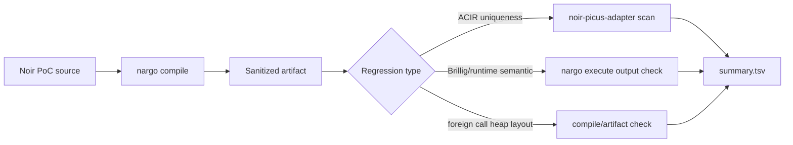
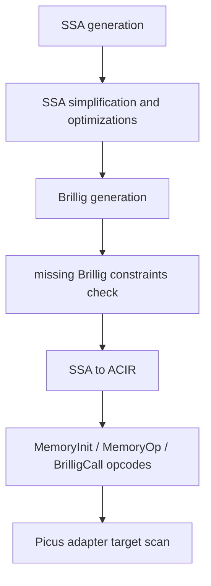

# Noir Compiler Regression Tier

This tier is separate from the vulnerable-chain corpus. The micro and realistic
tiers test whether `noir-picus-adapter` detects underconstrained ACIR targets.
Compiler-regression cases test whether the current Noir compiler still
reproduces known compiler/security bugs, and whether Picus can help on the
subset that becomes an ACIR uniqueness problem.

## Current Sources

The current seed set comes from Noir GitHub Security Advisories and one public
GitHub issue:

| Case | Source | Check |
| --- | --- | --- |
| `compiler_symbolic_array_index_brillig_output` | https://github.com/noir-lang/noir/issues/12581 | compile + Picus scan |
| `compiler_field_to_u128_cast_zero_branch` | https://github.com/noir-lang/noir/security/advisories/GHSA-cp84-xrj5-49vg | execute |
| `compiler_field_cast_branch_division` | https://github.com/noir-lang/noir/security/advisories/GHSA-683h-pgp9-8cq4 | execute |
| `compiler_brillig_result_mutation` | https://github.com/noir-lang/noir/security/advisories/GHSA-wvh3-mhm3-7wwv | execute |
| `compiler_brillig_load_store_forward_ifelse` | https://github.com/noir-lang/noir/security/advisories/GHSA-j4p3-qjx6-rmvx | execute |
| `compiler_foreign_call_nested_tuple_array` | https://github.com/noir-lang/noir/security/advisories/GHSA-jj7c-x25r-r8r3 | compile |

On May 30, 2026, GitHub listed many Noir advisories patched in
`1.0.0-beta.21`. The local compiler used by the corpus is
`1.0.0-beta.20+214dcce...`, so this tier is intentionally useful for checking
whether a checkout is behind security fixes.

## Flow



The runner is:

```bash
bash corpus/check_compiler_regression.sh
```

It writes logs to `/tmp/noir-picus-compiler-regression`, regenerates sanitized
artifacts under `corpus/compiler_regression_artifacts`, and removes generated
`target/` directories unless `NOIR_PICUS_KEEP_TARGETS=1` is set.

## Why Picus Initially Missed #12581

The symbolic-array-index PoC compiled to this ACIR shape:

```text
BRILLIG CALL ... outputs: [w3]
INIT b0 = [w3, w0, w0, w0]
READ w4 = b0[w1]
ASSERT w4 = w0
ASSERT w2 = w3
```

Before this pass the adapter marked `MemoryInit` and `MemoryOp` as unsupported,
so the return target was `unsupported` instead of `unsafe`.

The adapter now translates ACIR memory reads and writes:

- `MemoryInit` creates symbolic memory-block state.
- `READ value = block[index]` becomes one-hot selector constraints:
  selector booleanity, exactly-one selector, `index = sum(i * selector_i)`, and
  `value = sum(cell_i * selector_i)`.
- `WRITE block[index] = value` updates the symbolic block state with fresh cell
  wires so later reads depend on the write.

With this support, the #12581 case scans `unsafe` with `--solver cvc5 --theory
nia`. The finite-field query is currently much slower on this memory/selectors
shape, so the compiler-regression manifest records the solver/theory per scan
case.

## Trailmark Snapshot

Trailmark was run against the local Noir checkout:

| Path | Nodes | Functions | Call edges | Entry points |
| --- | ---: | ---: | ---: | ---: |
| `compiler/noirc_evaluator` | 2982 | 2566 | 17434 | 1 |
| `compiler/noirc_driver` | 52 | 40 | 434 | 1 |
| `compiler/noirc_frontend/src/hir` | 874 | 768 | 7803 | 0 |

High-complexity evaluator hotspots from Trailmark include
`ssa/ir/dfg/simplify/binary.rs:simplify_binary`,
`ssa/ir/dfg/simplify/call.rs:simplify_call`,
`ssa/interpreter/intrinsics.rs:Interpreter.call_intrinsic`, and
`ssa/interpreter/mod.rs:evaluate_binary`.

The security-relevant compiler path for this work is:



Compiler bugs split into two buckets:

- ACIR underconstraint bugs can be found by Picus if the adapter supports the
  opcodes on the target dependency path.
- Brillig/runtime semantic bugs can return a deterministic but wrong value.
  Picus uniqueness scanning is not enough for those; the runner checks
  execution output and should later grow differential/proof checks when a
  backend is available.
