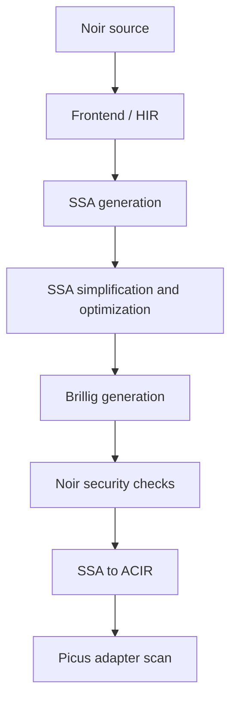

# Noir Picus Adapter Research Report

Date: May 30, 2026  
Repository snapshot: `noir-picus-adapter` local commit `6cc7157` plus working
tree changes  
Compiler: `/home/said/noir/target/debug/nargo`
`1.0.0-beta.20+214dcce417492306a09b8dca6e9d8f59581d0b26`  
Rust: `rustc 1.92.0`, `cargo 1.92.0`

## Executive Summary

This corpus now supports three distinct evaluation questions:

| Tier | Rows | Purpose | Acceptance result |
| --- | ---: | --- | --- |
| Micro vulnerable corpus | 40 | Fast regression over known ZK bug boundaries translated to Noir | `40/40 unsafe` |
| Realistic corpus | 40 | Medium/large/stress circuits with vulnerable and fixed variants | `20 unsafe`, `20 verified` |
| Noir compiler regression | 6 | Known Noir compiler/security PoCs from GitHub advisories/issues | `6/6 expected checks passed` |

For Picus-scanned labeled rows in the current corpus, the observed confusion
matrix is:

| Expected label | Reported unsafe | Reported verified | Unsupported/unknown |
| --- | ---: | ---: | ---: |
| Vulnerable | 61 | 0 | 0 |
| Fixed | 0 | 20 | 0 |

Interpretation: on this labeled regression corpus, the adapter currently finds
all modeled vulnerable targets and produces no false positives on fixed
realistic variants. This is not yet a claim about arbitrary production Noir
programs; the threats-to-validity section below lists the remaining gaps.

## Research Questions

| RQ | Question | Current answer |
| --- | --- | --- |
| RQ1 | Can the adapter detect source-faithful vulnerable witness/constraint chains translated from real ZK bugs? | Yes, all 40 micro cases and all 20 realistic vulnerable variants scan `unsafe`. |
| RQ2 | Does the adapter avoid false positives when the missing constraint is restored? | Yes, all 20 realistic fixed variants scan `verified`. |
| RQ3 | Does the approach scale beyond toy examples? | Partially. Stress variants reach 2051-2052 constraints and scan in under 0.75s after cone slicing. This is still not a full production rollup circuit. |
| RQ4 | What failures improved the tool? | Unsupported `MemoryInit/MemoryOp` caused a compiler PoC to be missed as `unsupported`; adding symbolic memory constraints made it `unsafe`. Earlier large-chain timeouts were fixed by fixed-known propagation and target cone slicing. |
| RQ5 | Can the same framework help study compiler bugs? | Yes for compiler bugs that manifest as ACIR non-uniqueness. Brillig/runtime semantic bugs need execution or differential checks, not only uniqueness scanning. |

## Methodology

The scanner checks uniqueness of selected target witnesses under fixed inputs.
For each target, it builds a self-composition query:

```text
constraints(x) and constraints(y) and fixed_inputs(x == y) and target_x != target_y
```

If the query is satisfiable, the target is underconstrained and the row is
reported `unsafe`. If it is unsatisfiable, the target is unique for the fixed
input set and is reported `verified`.

The corpus is intentionally split:

| Design choice | Rationale |
| --- | --- |
| Micro cases stay small | They isolate specific bug boundaries and run quickly as translator regressions. |
| Realistic cases wrap the same boundaries in longer chains | They measure performance and fixed/vulnerable discrimination on larger ACIR. |
| Fixed variants are mandatory | They are false-positive controls. |
| Compiler regression is separate | Compiler bugs may be semantic runtime bugs rather than ACIR underconstraint bugs. |
| Artifacts are sanitized | JSON artifacts contain only `noir_version` and `bytecode`, avoiding local paths/debug metadata. |

## Corpus Composition

### Micro Corpus By Original DSL

| Original DSL family | Cases |
| --- | ---: |
| Circom | 15 |
| Halo2 | 9 |
| Cairo | 3 |
| Arkworks / Arkworks-R1CS | 3 |
| Bellperson | 2 |
| Risc0 | 2 |
| Custom/Aztec | 1 |
| Gnark | 1 |
| PIL | 1 |
| PIL/zkASM | 1 |
| Plonky3 | 1 |
| zkEVM DSL | 1 |

The micro tier is not a balanced benchmark; it is a regression bank biased
toward real disclosed/audited bug boundaries available in public sources.

### Realistic Corpus By Size Tier

| Tier | Families | Variants | Expected vulnerable | Expected fixed |
| --- | ---: | ---: | ---: | ---: |
| Medium | 12 | 24 | 12 unsafe | 12 verified |
| Large | 6 | 12 | 6 unsafe | 6 verified |
| Stress | 2 | 4 | 2 unsafe | 2 verified |

The shared realistic helper library is 205 Noir LOC. Per-package entrypoints are
small wrappers, but the compiled ACIR contains the helper chains. Therefore ACIR
constraint count is the primary size metric in this report, not entrypoint LOC.

### Boundary-Class Coverage

| Boundary class | Realistic cases |
| --- | --- |
| Guarded equality bypass | `medium_merkle_airdrop_nullifier`, `medium_rlp_tx_calldata`, `medium_guarded_hash_bypass`, `medium_vm_alu_trace`, `large_passport_disclosure` |
| Quotient/remainder or division alias | `medium_bigint_modmul`, `medium_division_remainder_bound`, `large_zkevm_transaction` |
| Carry/high-limb/range alias | `medium_chacha_quarter_round`, `medium_zkemail_header_pack`, `medium_range_high_limb_alias` |
| Selector/one-hot interpolation | `medium_mpt_account_update`, `medium_selector_onehot_transfer` |
| Balance/fee conservation alias | `medium_fixed_point_order`, `large_private_rollup_batch`, `large_fee_conservation_alias` |
| VM transition delta | `large_vm_execution_trace` |
| Lookup/index membership alias | `large_lookup_index_membership` |
| Artificial stress guard/delta | `stress_rollup_mega_batch`, `stress_vm_mega_trace` |

This matters because an earlier version overused one boundary shape
`claimed_output + slack == computed_anchor`. The current corpus still has a
stable harness shape, but the vulnerable boundary varies.

## Main Results

### Detection Outcomes

| Gate | Expected | Observed | Unsupported | Unknown |
| --- | --- | --- | ---: | ---: |
| `check_corpus.sh` | 40 unsafe | 40 unsafe | 0 | 0 |
| `check_realistic_corpus.sh` vulnerable rows | 20 unsafe | 20 unsafe | 0 | 0 |
| `check_realistic_corpus.sh` fixed rows | 20 verified | 20 verified | 0 | 0 |
| `check_compiler_regression.sh` | mixed scan/execute/compile | 6 expected checks passed | 0 | 0 |

### Realistic Performance

| Group | Rows | Avg constraints | Min constraints | Max constraints | Avg time | Min time | Max time |
| --- | ---: | ---: | ---: | ---: | ---: | ---: | ---: |
| medium vulnerable | 12 | 187.0 | 99 | 291 | 109.9 ms | 56 ms | 199 ms |
| medium fixed | 12 | 188.0 | 100 | 292 | 84.6 ms | 41 ms | 145 ms |
| large vulnerable | 6 | 387.0 | 387 | 387 | 225.8 ms | 166 ms | 267 ms |
| large fixed | 6 | 388.0 | 388 | 388 | 164.7 ms | 127 ms | 210 ms |
| stress vulnerable | 2 | 2051.0 | 2051 | 2051 | 725.5 ms | 705 ms | 746 ms |
| stress fixed | 2 | 2052.0 | 2052 | 2052 | 608.0 ms | 527 ms | 689 ms |

Across all 40 realistic rows: average 433.9 constraints, max 2052 constraints,
average scan time 183.6 ms, max scan time 746 ms.

### Slowest Realistic Rows

| Case | Status | Wires | Constraints | Time |
| --- | --- | ---: | ---: | ---: |
| `stress_rollup_mega_batch/vulnerable` | unsafe | 2055 | 2051 | 746 ms |
| `stress_vm_mega_trace/vulnerable` | unsafe | 2055 | 2051 | 705 ms |
| `stress_rollup_mega_batch/fixed` | verified | 2055 | 2052 | 689 ms |
| `stress_vm_mega_trace/fixed` | verified | 2055 | 2052 | 527 ms |
| `large_private_rollup_batch/vulnerable` | unsafe | 391 | 387 | 267 ms |
| `large_fee_conservation_alias/vulnerable` | unsafe | 391 | 387 | 260 ms |

### Query Slicing Effect

For the current realistic vulnerable rows, each target query uses 2 original
constraints and 2 alternative constraints after slicing, even when the full
circuit has 2051 constraints. Fixed variants mostly exit through the
fixed-known fast path.

This supports the engineering hypothesis that production-like circuits should
be handled in two stages:

1. Adapter-side cone-of-influence slicing and fixed-known propagation.
2. Picus/QED solving on the reduced target cone.

Without stage 1, the solver receives the whole circuit and spends time on
irrelevant deterministic chains.

## Failure-Driven Tool Improvements

| Problem observed | Symptom | Root cause | Change made | Evidence |
| --- | --- | --- | --- | --- |
| Large fixed variants were slow | Fixed rows took tens of seconds in early loop | Solver had to prove UNSAT over a long deterministic chain | `fixed_known_signals` and solver fast path | Fixed realistic rows now verify in 41-689 ms |
| Long vulnerable variants timed out | Some JSON scans were empty due to wall timeout | Self-composition duplicated deterministic chains that were already fixed by public bindings | Use fixed-known closure as `known_signals` | All 20 realistic vulnerable rows now scan `unsafe` |
| Target query included irrelevant constraints | Large circuits sent whole ACIR to Picus | Adapter did not slice by return target | Constraint groups and `target_constraints()` cone slicing | Stress rows have 2051 full constraints but 2 target-query constraints |
| Compiler PoC `#12581` was not detected | Status was `unsupported` | ACIR `MemoryInit` and `MemoryOp` were unsupported on the dependency path | Added symbolic memory read/write constraints | `compiler_symbolic_array_index_brillig_output` now scans `unsafe` |

## MemoryOp Support Added For Compiler PoC

The `#12581` PoC compiles to:

```text
BRILLIG CALL ... outputs: [w3]
INIT b0 = [w3, w0, w0, w0]
READ w4 = b0[w1]
ASSERT w4 = w0
ASSERT w2 = w3
```

The adapter now models dynamic memory reads with one-hot selectors:

```text
selector_i in {0,1}
sum(selector_i) = 1
index = sum(i * selector_i)
read_value = sum(cell_i * selector_i)
```

Memory writes allocate a fresh symbolic state for every cell:

```text
new_cell_i = old_cell_i + selector_i * (written_value - old_cell_i)
```

Result for the compiler PoC:

| Metric | Value |
| --- | ---: |
| Wires | 74 |
| Full constraints | 75 |
| Unsupported reasons | 0 |
| Query constraints | 41 original + 41 alternative |
| Status | unsafe |
| Counterexample target values | `0` vs `2147483648` |

This is a concrete example of the improvement loop: a real known compiler bug
first produced `unsupported`, then adapter opcode support converted it into a
detected `unsafe`.

## Compiler Regression Tier

| Case | Source | Current check | Result |
| --- | --- | --- | --- |
| `compiler_symbolic_array_index_brillig_output` | https://github.com/noir-lang/noir/issues/12581 | Picus scan, `cvc5/nia` | unsafe |
| `compiler_field_to_u128_cast_zero_branch` | https://github.com/noir-lang/noir/security/advisories/GHSA-cp84-xrj5-49vg | `nargo execute` | `0x01` |
| `compiler_field_cast_branch_division` | https://github.com/noir-lang/noir/security/advisories/GHSA-683h-pgp9-8cq4 | `nargo execute` | `true` |
| `compiler_brillig_result_mutation` | https://github.com/noir-lang/noir/security/advisories/GHSA-wvh3-mhm3-7wwv | `nargo execute` | `[true]` |
| `compiler_brillig_load_store_forward_ifelse` | https://github.com/noir-lang/noir/security/advisories/GHSA-j4p3-qjx6-rmvx | `nargo execute` | `0x02` |
| `compiler_foreign_call_nested_tuple_array` | https://github.com/noir-lang/noir/security/advisories/GHSA-jj7c-x25r-r8r3 | compile/artifact | ok |

The compiler tier deliberately mixes checks. Picus uniqueness scanning is
appropriate for ACIR non-uniqueness bugs such as `#12581`. Brillig semantic bugs
can be deterministic but wrong, so they require execution or differential
compiler/prover checks.

## Trailmark Structural Snapshot

Trailmark was run on the local Noir compiler checkout:

| Path | Nodes | Functions | Call edges | Entry points |
| --- | ---: | ---: | ---: | ---: |
| `compiler/noirc_evaluator` | 2982 | 2566 | 17434 | 1 |
| `compiler/noirc_driver` | 52 | 40 | 434 | 1 |
| `compiler/noirc_frontend/src/hir` | 874 | 768 | 7803 | 0 |

High-complexity evaluator hotspots included:

| Function | Complexity |
| --- | ---: |
| `ssa/ir/dfg/simplify/binary.rs:simplify_binary` | 77 |
| `ssa/ir/dfg/simplify/call.rs:simplify_call` | 72 |
| `ssa/parser/token.rs:Keyword.lookup_keyword` | 69 |
| `ssa/interpreter/intrinsics.rs:Interpreter.call_intrinsic` | 57 |
| `ssa/interpreter/mod.rs:evaluate_binary` | 48 |

Security-relevant path for this work:



For future compiler-bug hunting, the most relevant areas are SSA
simplification, memory/reference optimizations, Brillig call lowering, and
checks for missing Brillig constraints.

## Reproducibility

Run the full evaluation:

```bash
cargo test
bash corpus/check_corpus.sh
bash corpus/check_realistic_corpus.sh
bash corpus/check_compiler_regression.sh
```

Expected terminal summaries:

```text
cargo test: 23 passed
micro: unsafe=40
realistic: fixed/verified=20, vulnerable/unsafe=20
compiler regression: checked 6 compiler regression cases
```

Artifact hygiene checks:

```bash
find corpus -type d -name target
rg "/home/said|debug_symbols|file_map|source" \
  corpus/artifacts corpus/realistic_artifacts corpus/compiler_regression_artifacts
```

Expected result: no `target/` directories and no sanitizer hits.

## Threats To Validity

| Threat | Impact | Mitigation / status |
| --- | --- | --- |
| Miniports are not full production projects | Results may overestimate behavior on whole applications | Realistic/stress tier adds larger chains, but true full-project benchmarks are still future work |
| Heavy crypto is substituted | Hash/permutation cost and opcode mix differ from production | Translation notes document substitutions; core vulnerable boundary is preserved |
| Single return target per row | Multi-output interactions are under-tested | Future tier should include multiple return/public targets |
| Fixed variants are manually written | A fixed row may overconstrain more than the real patch | Provenance and vulnerable/fixed deltas should be reviewed per row |
| Solver/theory choice matters | `cvc5/ff` and `cvc5/nia` behave differently on selector-heavy memory queries | Manifest records solver/theory for compiler scan rows |
| Compiler checkout is dirty beta.20 | Results depend on local Noir state | Report records exact `nargo`/commit version |
| Compiler tier lacks proof-backend differential checks | Some semantic bugs may execute correctly but still have proof-level issues | Add `bb prove/verify` differential checks when backend is available |
| Corpus labels are synthetic expectations | Confusion matrix is not a field accuracy estimate | Present results as regression-corpus evidence, not real-world prevalence |

## Publication-Safe Claims

The following claims are supported by the current data:

1. The adapter detects all modeled underconstrained return-target vulnerabilities
   in the 60-row vulnerable ACIR corpus plus the `#12581` compiler PoC.
2. The adapter verifies all 20 fixed realistic variants, showing no false
   positives on the current fixed controls.
3. Target cone slicing and fixed-known propagation materially improve scaling
   on medium/large/stress corpus rows.
4. Unsupported opcode triage is necessary: adding `MemoryInit/MemoryOp` support
   changed a real compiler PoC from `unsupported` to `unsafe`.
5. Picus uniqueness scanning is useful for compiler bugs only when the bug
   manifests as non-unique ACIR witnesses; deterministic wrong-code bugs require
   execution/differential testing.

Claims that are not yet supported:

1. The tool scales to arbitrary production Noir applications.
2. The corpus fully represents the distribution of real ZK vulnerabilities.
3. The compiler tier finds new unknown Noir compiler bugs.
4. The scanner is complete for all ACIR opcodes.

## Next Research Steps

| Step | Why it matters |
| --- | --- |
| Add full-project Noir benchmarks | Measure real production opcode mix, not only miniports |
| Add multi-target cases | Test interactions between return values, public outputs, and Brillig outputs |
| Add proof-backend differential checks for compiler tier | Validate semantic/proof-level compiler bugs beyond execution output |
| Record per-query SMT size and solver time separately | Separate translation overhead from solver complexity |
| Expand ACIR opcode support by triage frequency | Prioritize opcodes that block real compiler or production fixtures |
| Add ablation mode flags | Quantify speedup from fixed-known propagation vs cone slicing vs memory support |
